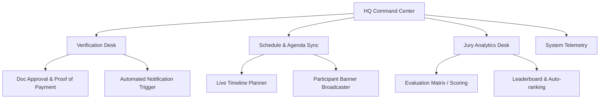
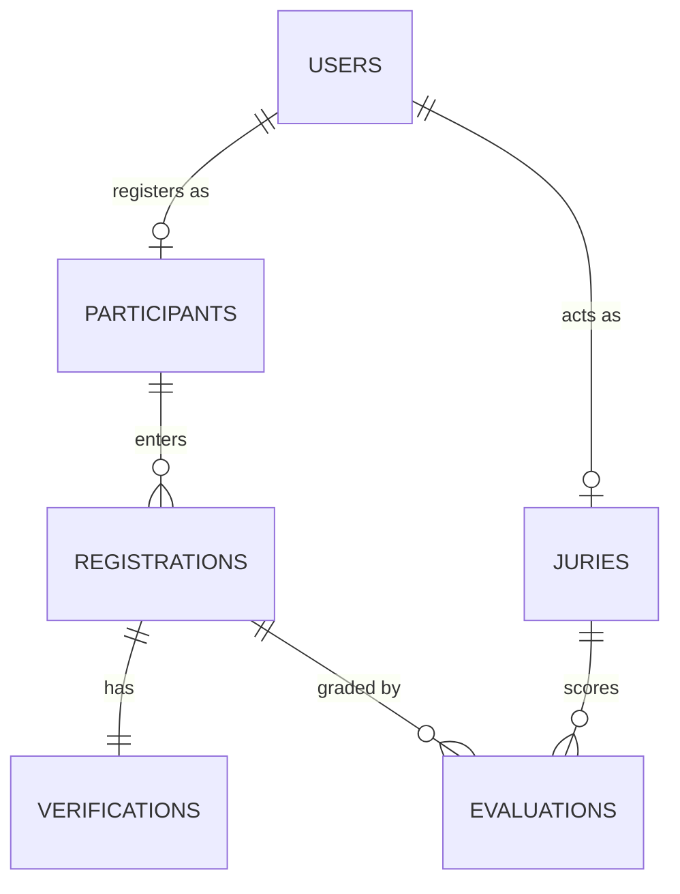

# 🎛️ NCC 13th Command Center: Admin Dashboard Architecture

Sistem manajemen **Command Center** untuk **National Creativity Competition (NCC 13th) SMA Darul Ulum 1** dirancang untuk menyeimbangkan performa tinggi (*high performance*) dengan visualisasi interaktif modern yang tetap profesional dan *clean* (menggunakan estetika *Soft Earthy* & *Glassmorphism*).

Berikut adalah rancangan arsitektur lengkap yang siap diimplementasikan untuk mengelola data pendaftaran, verifikasi, jadwal acara, hingga rekap penilaian juri.

---

## 🧭 1. Arsitektur Komponen & Navigasi (Command Center UI)

Dashboard Admin dibagi menjadi beberapa sub-modul utama untuk menjaga modularitas dan memudahkan kolaborasi tim panitia:



### Modul-Modul Utama:
1. **Verification Desk (`/hq/verification`)**: Modul khusus untuk tim verifikator guna memvalidasi data pendaftar (biodata, kartu pelajar, bukti pembayaran).
2. **Schedule & Agenda Sync (`/hq/schedule`)**: Manajemen linimasa kompetisi secara *real-time* yang langsung tersinkronisasi ke dasbor peserta.
3. **Jury Desk & Scoring (`/hq/juri`)**: Antarmuka penilaian karya (khususnya untuk LKTI Nasional dan English Festival) dengan kalkulasi rata-rata otomatis.
4. **System Telemetry & Analytics (`/hq/analytics`)**: Dashboard visualisasi sebaran asal provinsi peserta, popularitas cabang lomba, serta tren harian registrasi.

---

## 🗄️ 2. Skema Database (Supabase / PostgreSQL)

Untuk mendukung sinkronisasi instan (*real-time database subscription*), database PostgreSQL dirancang dengan relasi yang kokoh antara tabel pengguna, pendaftaran cabang, berkas verifikasi, dan penilaian juri.



### Tabel Utama:

#### A. Tabel `registrations` (Data Pendaftaran Lomba)
Menyimpan entitas tim atau individu yang mendaftar pada cabang lomba tertentu.
```sql
CREATE TABLE registrations (
  id UUID PRIMARY KEY DEFAULT gen_random_uuid(),
  team_name VARCHAR(100) NOT NULL,
  school_origin VARCHAR(150) NOT NULL,
  branch_id INT NOT NULL, -- 1: MIPA, 2: IPS, 3: LKTI, 4: English, 5: Robotics
  contact_phone VARCHAR(20) NOT NULL,
  created_at TIMESTAMP WITH TIME ZONE DEFAULT CURRENT_TIMESTAMP,
  status VARCHAR(20) DEFAULT 'pending' -- pending, verified, rejected
);
```

#### B. Tabel `verifications` (Log & Berkas Verifikasi)
Menyimpan bukti pembayaran dan kelayakan berkas fisik siswa.
```sql
CREATE TABLE verifications (
  id UUID PRIMARY KEY DEFAULT gen_random_uuid(),
  registration_id UUID REFERENCES registrations(id) ON DELETE CASCADE,
  proof_of_payment_url TEXT NOT NULL,
  student_ids_url TEXT[] NOT NULL, -- Array URL berkas identitas anggota
  verified_by UUID REFERENCES users(id),
  rejection_reason TEXT, -- Alasan jika verifikasi ditolak
  updated_at TIMESTAMP WITH TIME ZONE DEFAULT CURRENT_TIMESTAMP
);
```

#### C. Tabel `evaluations` (Matriks Penilaian Juri)
Menyimpan nilai kuantitatif dari juri untuk penentuan pemenang otomatis.
```sql
CREATE TABLE evaluations (
  id UUID PRIMARY KEY DEFAULT gen_random_uuid(),
  registration_id UUID REFERENCES registrations(id) ON DELETE CASCADE,
  jury_id UUID REFERENCES users(id),
  score_structure JSONB NOT NULL, -- Menyimpan sub-nilai (misal: Orisinalitas, Presentasi, dll.)
  total_score NUMERIC(5, 2) NOT NULL,
  comments TEXT,
  submitted_at TIMESTAMP WITH TIME ZONE DEFAULT CURRENT_TIMESTAMP
);
```

---

## 🔒 3. Keamanan & Kontrol Akses (RBAC)

Keamanan dasbor menggunakan pola **Role-Based Access Control (RBAC)** untuk memastikan privasi data peserta terlindungi. Supabase Row Level Security (RLS) digunakan secara ketat:

| Peran (Role) | Hak Akses (Permissions) | Deskripsi |
| :--- | :--- | :--- |
| **Super Admin** | `ALL` | Kontrol penuh sistem, ekspor data (Excel/PDF), manajemen akun juri. |
| **Verificator** | `READ` registrations, `UPDATE` status | Memvalidasi berkas dan menyetujui status pendaftaran peserta. |
| **Jury** | `READ` registrations (cabang terkait), `WRITE` evaluations | Menginput nilai evaluasi karya peserta di cabang kompetisi masing-masing. |
| **Participant** | `READ/WRITE` data miliknya sendiri | Mengisi form registrasi, mengunggah berkas, dan memantau pengumuman. |

---

## ⚡ 4. Alur Sinkronisasi Real-Time & Notifikasi

Untuk menjamin kenyamanan operasional panitia di lapangan, kita memanfaatkan **Supabase Realtime Channel**:

1. **Live State Updates**: Ketika verifikator menyetujui pendaftaran, komponen `VerificationTab.tsx` memperbarui status di database.
2. **Instant Broadcast**: Supabase menyebarkan perubahan ke portal peserta secara instan tanpa perlu memuat ulang (*reload*) halaman.
3. **Automated Notification**: Fungsi Postgres Trigger memicu webhook untuk mengirimkan email konfirmasi atau notifikasi WhatsApp otomatis:
   - *"Selamat! Berkas tim Anda untuk LKTI Nasional telah diverifikasi secara penuh oleh panitia."*

---

## 🛠️ Langkah Rekomendasi Implementasi Selanjutnya

1. **Pembuatan File Rute HQ**: Menyusun `src/app/hq/layout.tsx` untuk kerangka navigasi bilah samping (*sidebar navigation*).
2. **Koneksi Database & API**: Menulis fungsi *server actions* di Next.js untuk penarikan data registrasi secara aman dan cepat (*SSR & Incremental Static Regeneration*).
3. **Sistem Ekspor Cepat**: Menyediakan tombol sekali-klik (*one-click button*) bagi Super Admin untuk mengunduh rekapitulasi data pendaftar dalam format `.xlsx` (menggunakan pustaka `xlsx` atau `exceljs`).
